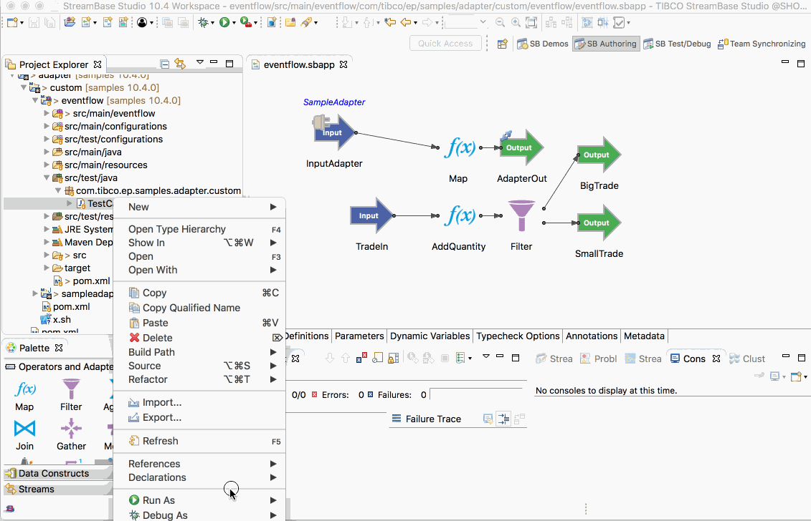

# Adapter : EventFlow

This sample describes how to use a custom adapter in EventFlow.

## Import the adapter as a dependency

This sample already contains the sample adapter as a dependency, but to use the adapter on a new 
project open the **pom.xml** file and use the **Dependency** tab to add the adapter :

## Add adapter to EventFlow

To add a new sample adapter to the EventFlow, drag the java adapter icon to the EventFlow, set the adapter 
type and configure the schema :

## Running this sample from TIBCO StreamBase Studio&trade;

Use the **Run As -> EventFlow Fragment** menu option to run in TIBCO StreamBase Studio&trade;, and then enqueue test messages :

## Building this sample from TIBCO StreamBase Studio&trade; and running the unit test cases

Use the **Run As -> EventFlow Fragment Unit Test** menu option to build from TIBCO StreamBase Studio&trade; :

## Building this sample from the command line and running the unit test cases

Use the [maven](https://maven.apache.org) as **mvn install** to build from the command line or Continuous Integration system :

