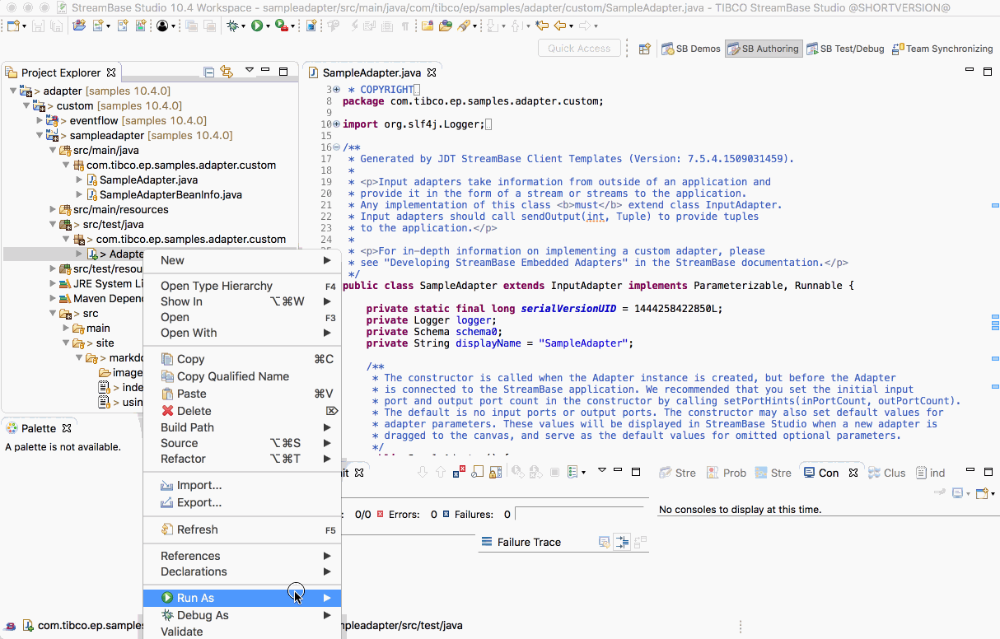
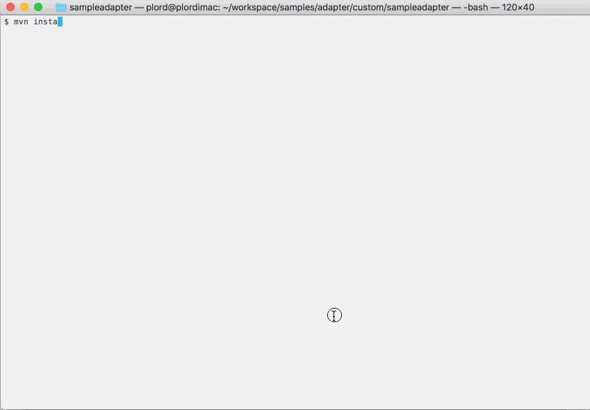

# Adapter : Sample Adapter

This sample describes how to build a custom adapter.

## Maven pom.xml

The maven pom.xml should be of pacjage type **jar** but use the **ep-eventflow-fragment** parent to
bring in the right dependencies :

```xml
<?xml version="1.0" encoding="UTF-8"?>
<project xmlns="http://maven.apache.org/POM/4.0.0" xmlns:xsi="http://www.w3.org/2001/XMLSchema-instance" xsi:schemaLocation="http://maven.apache.org/POM/4.0.0 http://maven.apache.org/xsd/maven-4.0.0.xsd">

    <!-- vim: set tabstop=4 softtabstop=0 expandtab shiftwidth=4 smarttab : -->

    <modelVersion>4.0.0</modelVersion>

    <groupId>com.tibco.ep.samples.adapter.custom</groupId>
    <artifactId>sampleadapter</artifactId>
    <packaging>jar</packaging>
    <version>1.0.0</version>
    <name>Adapter : Custom - Sample Adapter</name>
    <description>How to build and unit test a custom adapter.</description>
    
    <!-- common definitions for this version of StreamBase -->
    <parent>
        <groupId>com.tibco.ep.sb.parent</groupId>
        <artifactId>ep-eventflow-fragment</artifactId>
        <version>10.4.0-SNAPSHOT</version>
        <relativePath/>
    </parent>

</project>

```

## Sample adapter source

For the sample adapter source, see [SampleAdapter.java](../../main/java/com/tibco/ep/samples/adapter/custom/SampleAdapter.java) and 
[SampleAdapterBeanInfo.java](../../main/java/com/tibco/ep/samples/adapter/custom/SampleAdapterBeanInfo.java).

For the unit test cases, see [AdapterTest.java](../../test/java/com/tibco/ep/samples/adapter/custom/AdapterTest.java).

Documentation on how to write adapters can be found in [Creating Custom Java Embedded Adapters](https://docs.tibco.com/pub/sb-cep/10.3.0/doc/html/apiguide/dev-adapter.html#adapterapi).

## Building this sample from TIBCO StreamBase Studio&trade; and running the unit test cases

Use the **Run As -> Java Fragment Unit Test** menu option to build from TIBCO StreamBase Studio&trade; :



## Building this sample from the command line and running the unit test cases

Use the [maven](https://maven.apache.org) as **mvn install** to build from the command line or Continuous Integration system :

