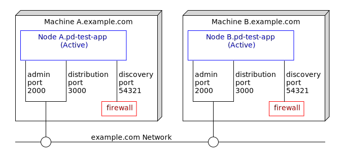
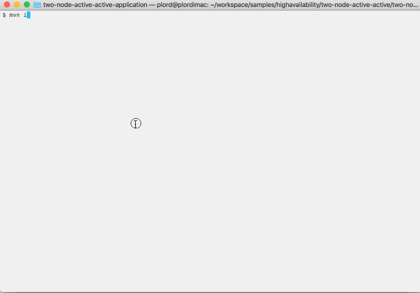

# Docker : 2-node active active with proxy discovery

Testing proxy discovery configurations can be difficult since often in test hardware, networks
do not block the discovery messages.  This sample describes how to use docker to test proxy discovery.

* [Machines and nodes](#machines-and-nodes)
* [Define the application definition configuration](#define-the-application-definition-configuration)
* [Define the node deployment configuration](#define-the-node-deployment-configuration)
* [Changes to the default docker configurations](#changes-to-the-default-docker-configurations)
* [Building this sample from the command line and running the integration test cases](#building-this-sample-from-the-command-line-and-running-the-integration-test-cases)

## Machines and nodes

In this sample we name the docker machines as **A.example.com**,  which hosts the StreamBase node **A.pd-test-app**, 
and **B.example.com**, which hosts the StreamBase node **B.pd-test-app**.



## Define the application definition configuration

For running in a docker container, we use System V shared memory for performance :


```scala
name = "pd-test-app"
version = "1.0.0"
type = "com.tibco.ep.dtm.configuration.application"

configuration = {
    ApplicationDefinition = {
        execution {
            nodeTypes {
                docker {
                    sharedMemory = {
                        memoryType = SYSTEM_V_SHARED_MEMORY
                    }
                }
            }
        }
    }
}
```

## Define the node deployment configuration

In this sample we include the proxyDiscovery setting and specify hostnames and ports so that the nodes can be made 
aware of each other.

```scala
name = "pd-test-app"
version = "1.0.0"
type = "com.tibco.ep.dtm.configuration.node"

configuration = {
    NodeDeploy = {
        nodes = {
            "A.pd-test-app" = { 
            	nodeType = docker
                engines = {
                    pd-test-ef = {
                        fragmentIdentifier = "com.tibco.ep.samples.docker.pd-test-ef"                                                                
                    }                                                    
                }
                communication = {
                    administration = {
                        address = ${A_HOSTNAME:-A.example.com}
                        transportPort = ${A_ADMINPORT:-2000}
                    }
                    distributionListenerInterfaces = [ {
                        address = ${A_HOSTNAME:-A.example.com}
                        dataTransportPort = ${A_DATATRANSPORTPORT:-3000}
                    } ]
                    proxyDiscovery = {
                        remoteNodes = [ ".*" ]
                    }
                }
                availabilityZoneMemberships = {
                    default-cluster-wide-availability-zone = {
                    }
                }
            }
            "B.pd-test-app" = { 
            	nodeType = docker
                engines = {
                    pd-test-ef = {
                        fragmentIdentifier = "com.tibco.ep.samples.docker.pd-test-ef"                                                                
                    }                                                    
                }
                communication = {
                    administration = {
                        address = ${B_HOSTNAME:-B.example.com}
                        transportPort = ${B_ADMINPORT:-2000}
                    }
                    distributionListenerInterfaces = [ {
                        address = ${B_HOSTNAME:-B.example.com}
                        dataTransportPort = ${B_DATATRANSPORTPORT:-3000}
                    } ]
                    proxyDiscovery = {
                        remoteNodes = [ ".*" ]
                    }
                }
                availabilityZoneMemberships = {
                    default-cluster-wide-availability-zone = {
                    }
                }
            }
        }
        availabilityZones = {
            default-cluster-wide-availability-zone = {
                dataDistributionPolicy = "default-dynamic-data-distribution-policy"
            }
        }
    }
}

```

## Changes to the default docker configurations

The base image [Dockerfile](../../src/main/docker/base/Dockerfile) is updated to include the sudo tool and its configuration :

```dockerfile
RUN yum --assumeyes install \
    sysstat \
    gdb \
    java-1.8.0-openjdk \
    zip \
    unzip \
    perl \
    net-tools \
    iptables \
    tc \
    sudo \
    && yum clean all
...
RUN echo "${USER_NAME} ALL=(ALL) NOPASSWD: ALL" >> /etc/sudoers
```

The [start-node](../../src/main/docker/base/start-node) script is updated to set firewall rules to drop in-bound discovery :

```shell
sudo iptables -I INPUT ! -s ${HOSTNAME} -p udp --dport 54321 -j DROP
```

The maven [pom.xml](../../pom.xml) file is updated to detect if docker is installed :

```xml
    <properties>
        <dockerDomain>example.com</dockerDomain>
        <skipApplicationDocker>true</skipApplicationDocker>
        <skipStreamBaseDockerBase>true</skipStreamBaseDockerBase>
        <skipDockerTests>true</skipDockerTests>
    </properties>
    ...
    <!-- if docker is available, build docker projects -->
    <profile>
        <id>Docker in local</id>
        <activation>
            <file>
                <exists>/usr/local/bin/docker</exists>
            </file>
        </activation>
        <properties>
            <skipApplicationDocker>false</skipApplicationDocker>
            <skipStreamBaseDockerBase>false</skipStreamBaseDockerBase>
            <skipDockerTests>${skipTests}</skipDockerTests>
        </properties>
    </profile>
    <profile>
        <id>Docker in bin</id>
        <activation>
            <file>
                <exists>/usr/bin/docker</exists>
            </file>
        </activation>
        <properties>
            <skipApplicationDocker>false</skipApplicationDocker>
            <skipStreamBaseDockerBase>false</skipStreamBaseDockerBase>
            <skipDockerTests>${skipTests}</skipDockerTests>
        </properties>
    </profile>
    <profile>
        <id>Docker in C:</id>
        <activation>
            <file>
                <exists>C:\Program Files\Docker\Docker\resources\bin\docker.exe</exists>
            </file>
        </activation>
        <properties>
            <skipApplicationDocker>false</skipApplicationDocker>
            <skipStreamBaseDockerBase>false</skipStreamBaseDockerBase>
            <skipDockerTests>${skipTests}</skipDockerTests>
        </properties>
    </profile>
``` 

and include running **epadmin display cluster** when the nodes are started - this shows if the nodes are connected to
each other via the proxy discovery configuration :

```xml
    <exec>
        <postStart>epadmin servicename=B.${project.artifactId} display cluster</postStart>
    </exec>
```

## Building this sample from the command line and running the integration test cases

Use the [maven](https://maven.apache.org) as **mvn install** to build from the command line or Continuous Integration system :

