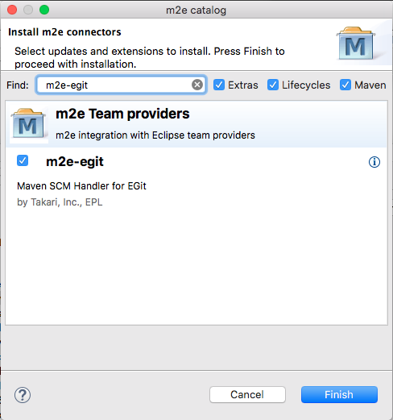
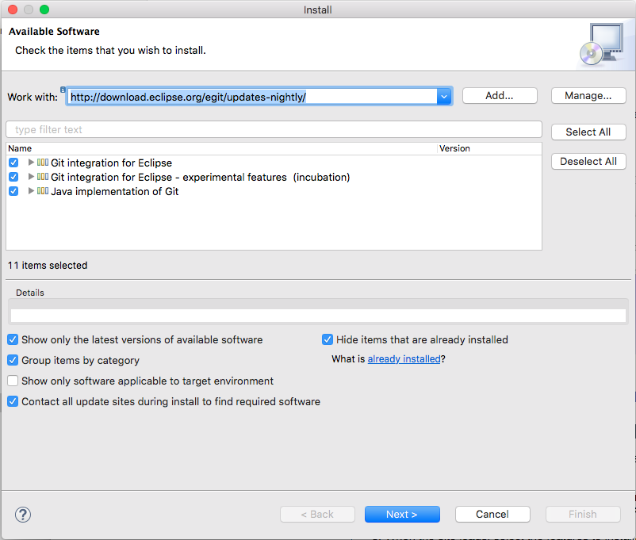

# Using in studio

* Recommended plugins

    :heavy_exclamation_mark: We can choose to ship these with studio.
 
    * m2e-git
        1. Preferences -> Maven -> Discovery -> Open Catalog
        2. Search for m2e-egit
        3. Select and install 
        

    * egit 5.1
        1. Help -> Install new software
        2. Set **Work with** to http://download.eclipse.org/egit/updates-nightly/
        3. Tick select all
        
