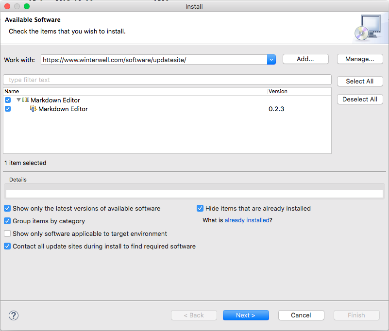
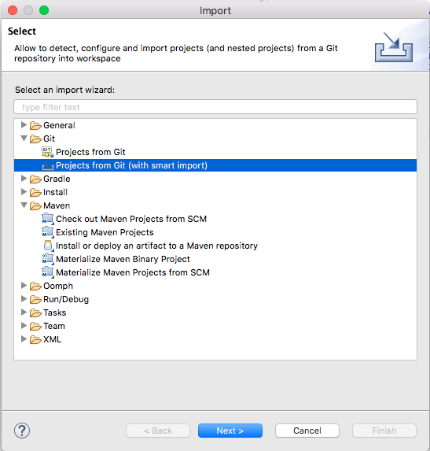
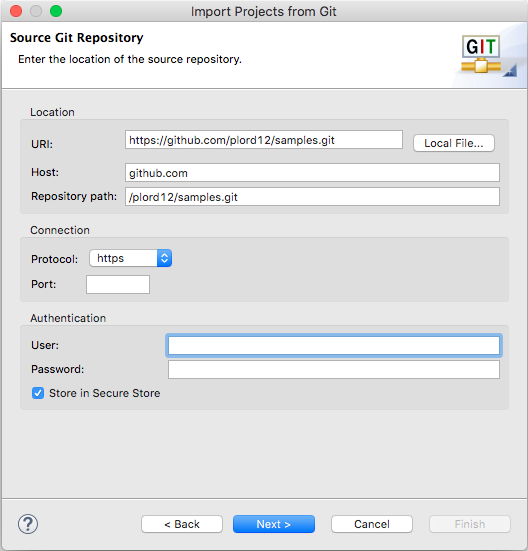
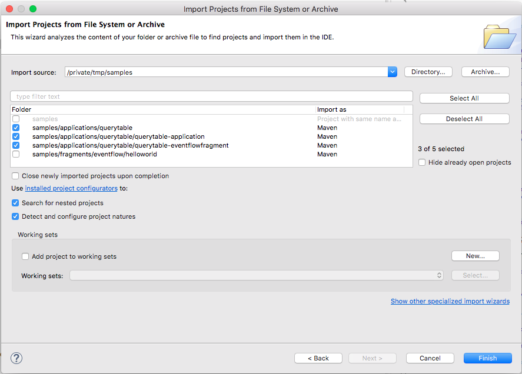
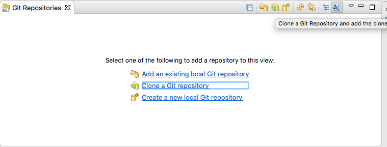
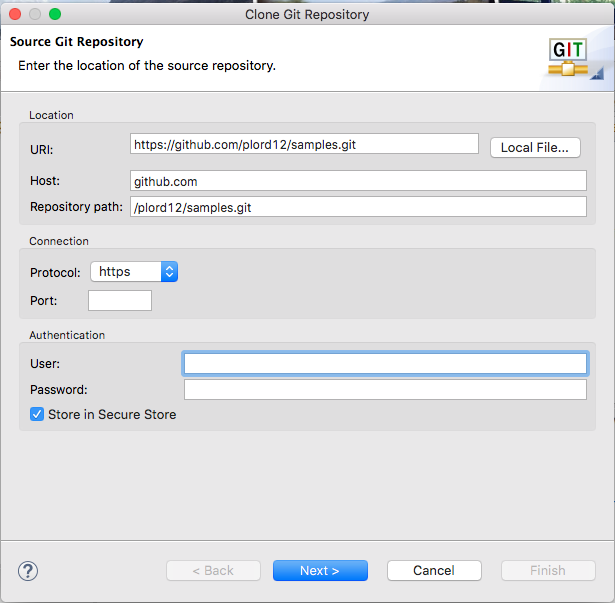
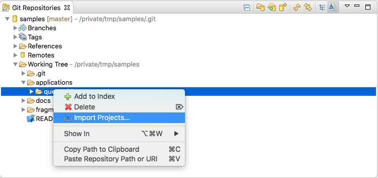
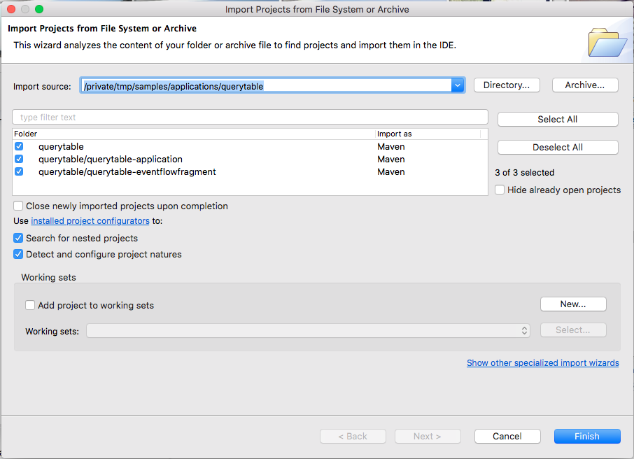
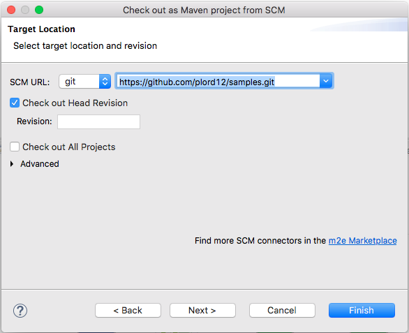
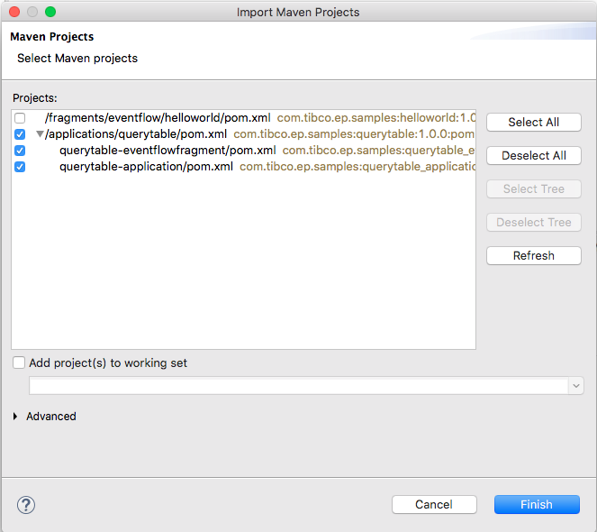

# Using in studio

* [Recommended plugins](#recommended-plugins)
* [Options to import samples to studio](#options-to-import-samples-to-studio)

## Recommended plugins

:heavy_exclamation_mark: We can choose to ship these with studio.
 
* m2e-git
    1. Preferences -> Maven -> Discovery -> Open Catalog
    2. Search for m2e-egit
    3. Select and install

    

    :heavy_exclamation_mark: See https://stackoverflow.com/questions/51359823/m2e-egit-connector-for-scm-on-eclipse-photon-failure if installation fails

* egit 5.1
    1. Help -> Install new software
    2. Set **Work with** to http://download.eclipse.org/egit/updates-nightly/
    3. Tick select all

    

    :heavy_exclamation_mark: I found this works with standard eclipse but not Studio

* markdown editor
    1. Help -> Install new software
    2. Set **Work with** to https://www.winterwell.com/software/updatesite/
    3. Tick select all

    

## Options to import samples to studio
 
* Import samples using egit 5.1 ( not currently in studio builds )

    * Import -> Projects from Git ( with smart import )

    

    * Clone URI
    * Set **URI** to https://github.com/plord12/samples.git

    

    * Choose what sample(s) to import

    

* Import samples using egit 5.0 ( currently in studio builds )

    * Window -> Show view -> Other -> Git -> Git Repositories
    * Click **Clone a Git repository**

    

    * Set **URI** to https://github.com/plord12/samples.git

    

    * Next -> Next -> Finish
    * Expand Working Tree and select sample and Import Projects

    

    * Finish

    

* Import samples using m2e-git ( not currently in studio builds )

    * Import -> Maven -> Check out Maven Projects from SCM
    * Set **SCM URL** to git and https://github.com/plord12/samples.git
    * Untick **Check out All Projects**

    

    * Select Next then Finish
    * Choose what sample(s) to import

    
