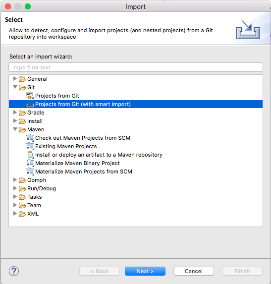
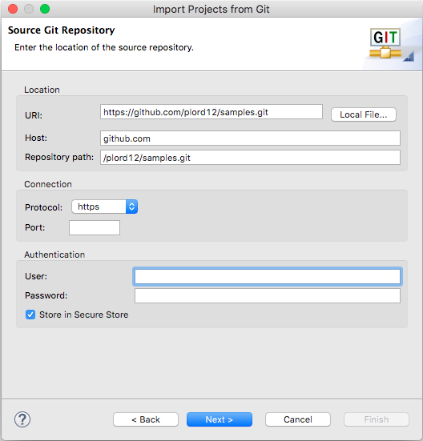
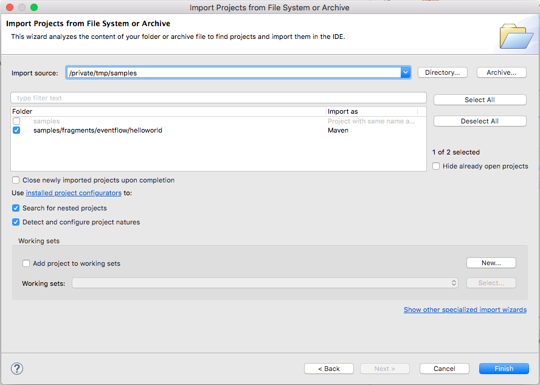

# Using in studio

* Recommended plugins

    :heavy_exclamation_mark: We can choose to ship these with studio.
 
    * m2e-git
        1. Preferences -> Maven -> Discovery -> Open Catalog
        2. Search for m2e-egit
        3. Select and install

        

        :heavy_exclamation_mark: See https://stackoverflow.com/questions/51359823/m2e-egit-connector-for-scm-on-eclipse-photon-failure if installation fails

    * egit 5.1
        1. Help -> Install new software
        2. Set **Work with** to http://download.eclipse.org/egit/updates-nightly/
        3. Tick select all

        

* Import samples using egit 5.1 ( not currently in studio builds )

    * Import -> Projects from Git ( with smart import )

    

    * Close URI
    * Set **URI** to https://github.com/plord12/samples.git

    

    * Choose what samples to import

    

    :heavy_exclamation_mark: add more images once we have more projects in

* Import samples using egit 5.0 ( currently in studio builds )

* Import samples using m2e-git ( not currently in studio builds )

