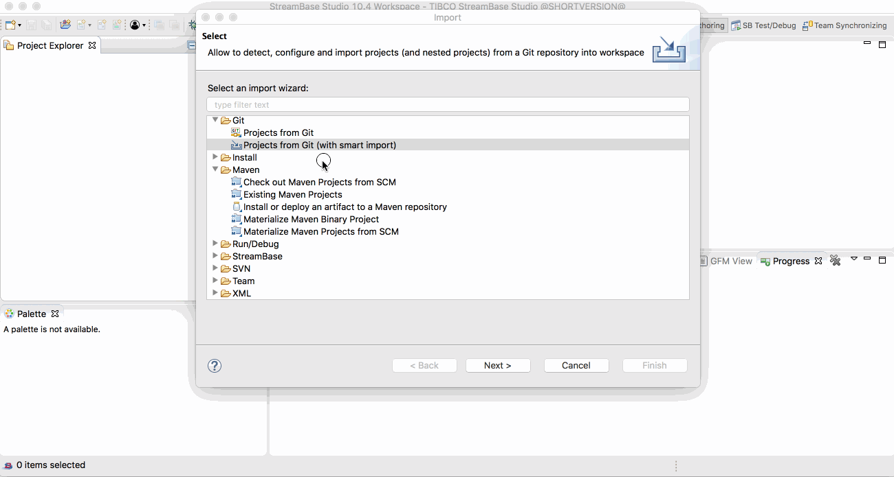

# Using in TIBCO StreamBase Studio&trade;

These samples are kept on-line in github - this allows browsing of the samples on-line,
support of contributions outside of TIBCO engineering and updates outside of the main
product release lifecycle.

The samples can also be imported into TIBCO StreamBase Studio&trade; :

## Using smart import

Use **Import -> Git -> Projects from Git ( with smart import )** menu option.  Specify the github URL and choose what sample(s) to import :

:warning: This does require the **Git integration for eclipse - auto-import for Eclipse** to be installed.   

## Using TIBCO menu

TBD

## Other useful eclipse plugins

* [Markdown Text Editor](https://marketplace.eclipse.org/content/markdown-text-editor)
* [GitHub Flavored Markdown viewer plugin](https://marketplace.eclipse.org/content/github-flavored-markdown-viewer-plugin)
* [Mylyn WikiText](https://marketplace.eclipse.org/content/mylyn-wikitext)
