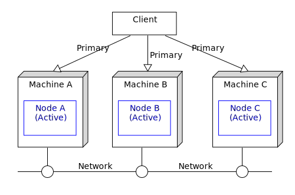
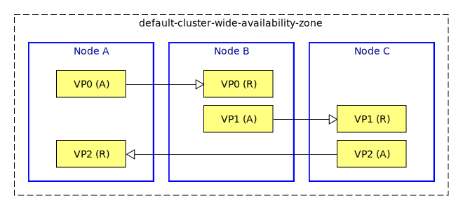

# HA : 3-node active active

This sample describes how to deploy an EventFlow fragment in a 3-node active active configuration.

* [Machines and nodes](#machines-and-nodes)
* [Data partitioning](#data-partitioning)
* [Define the application definition configuration](#define-the-application-definition-configuration)
* [Define the node deployment configuration](#define-the-node-deployment-configuration)
* [Design notes](#design-notes)
* [Failure scenarios](#failure-scenarios)
* [Building this sample from the command line and running the integration test cases](#building-this-sample-from-the-command-line-and-running-the-integration-test-cases)

## Machines and nodes

In this sample we name the machines as **A**,  which hosts the StreamBase node **A**, 
**B**, which hosts the StreamBase node **B** and **C** which hosts StreamBase node **C**.



A client that uses the service can connect to any machine.

( service names are omitted in descriptions for clarity )

## Data partitioning

To support an active active configuration, the query table data must be replicated between the nodes.  
In this sample the default **default-cluster-wide-availability-zone** is used - a number of virtual
partitions are created to evenly balance and replicate data around the cluster :



( only 3 virtual partitions are shown - the default is 64 )

## Define the application definition configuration

Since this sample uses the default data distribution policy, it doesn't need to be specified again,
so the application definition configuration is :


```scala
// Application definition configuration
//
name = "aa-3node-app"
version = "1.0.0"
type = "com.tibco.ep.dtm.configuration.application"

configuration = {
    ApplicationDefinition = {
        execution {
            nodeTypes {
                docker {
                    sharedMemory = {
                        memoryType = SYSTEM_V_SHARED_MEMORY
                    }
                }
            }
        }
    }
}
```

## Define the node deployment configuration

The **minimumNumberOfVotes** configuration enables quorums, so the node deployment
configuration is :

```scala
name = "aa-3node-app"
version = "1.0.0"
type = "com.tibco.ep.dtm.configuration.node"

configuration = {
    NodeDeploy = {
        nodes = {
            "${EP_NODE_NAME}" = {
                engines = {
                    aa-3node-ef = {
                        fragmentIdentifier = "com.tibco.ep.samples.highavailability.aa-3node-ef"                                                                
                    }                                                    
                }
                availabilityZoneMemberships = {
                    default-cluster-wide-availability-zone = {
                    }
                }
            }          
        }
        availabilityZones = {
            default-cluster-wide-availability-zone = {
                dataDistributionPolicy = "default-dynamic-data-distribution-policy"
                // enable quorums - each node must be able to see itself plus 1 other node
                //
                minimumNumberOfVotes = 2
            }
        }
    }
}
```

Note that **percentageOfVotes** could be used instead.  An alternative configuration for quorums could
use **quorumMemberPattern**.

## Design notes

* The default dynamic data distribution policy is chosen to distribute the data across the cluster
* Most of the data distribution policy and the availability zone configuration values are not set since defaults work well


## Failure scenarios

The main failure cases for this deployment are outlined below :

Failure case   | Behaviour on failure | Steps to resolve | Notes
--- | --- | --- | ---
Machine A fails | 1 Client is disconnected<br/>2 Virtual partitions become active on B & C<br/>3 Client may connect to B or C and continue  | 1 Fix machine A<br/>2 Use **epadmin install node** and **epadmin start node** | 1 No data loss<br/>2 No service loss
Machine B fails | 1 Client is disconnected<br/>2 Virtual partitions become active on A & C<br/>3 Client may connect to A or C and continue  | 1 Fix machine B<br/>2 Use **epadmin install node** and **epadmin start node** | 1 No data loss<br/>2 No service loss
Machine C fails | 1 Client is disconnected<br/>2 Virtual partitions become active on A & B<br/>3 Client may connect to A or B and continue  | 1 Fix machine C<br/>2 Use **epadmin install node** and **epadmin start node** | 1 No data loss<br/>2 No service loss
Network fails to A | 1 Quorum on A fails and takes itself offline to avoid multi-master | 1 Fix network<br/>2 Use **epadmin restore availabilityzone** | 1 No data loss<br/>2 No service loss
Network fails to B | 1 Quorum on B fails and takes itself offline to avoid multi-master | 1 Fix network<br/>2 Use **epadmin restore availabilityzone** | 1 No data loss<br/>2 No service loss
Network fails to C | 1 Quorum on C fails and takes itself offline to avoid multi-master | 1 Fix network<br/>2 Use **epadmin restore availabilityzone** | 1 No data loss<br/>2 No service loss

With a 3 node configuration node quorums can be applied to avoid a multi-master scenario.

## Building this sample from the command line and running the integration test cases

In this sample, some HA integration test cases are defined in the pom.xml that :

* start nodes A, B & C
* use **epadmin start playback** to inject tuples to node A
* use **epadmin read querytable** on node A to verify query table contents
* stop node A
* use **epadmin read querytable** on node B to verify no data loss
* stop node B

:warning: This does not constitute an exhaustive non-functional test plan

Use the [maven](https://maven.apache.org) as **mvn install** to build from the command line or Continuous Integration system :


