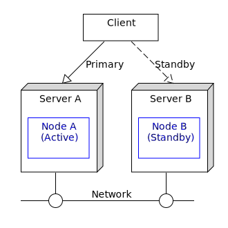
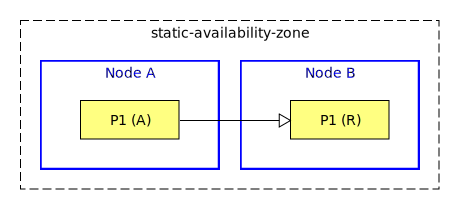
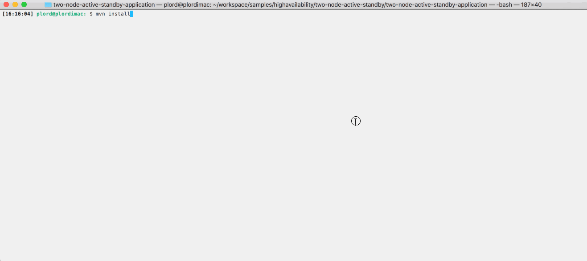

# HA : 2-node active standby

How to deploy an EventFlow fragment in a 2-node active standby configuration.

## Servers and nodes

In this sample we name the initially active server as **A** which hosts the StreamBase node **A**.  
The standby server is named **B** which hosts the StreamBase node **B**.



A client that uses the service initially connects to server **A**.

## Data partitioning

To support an active standby configuration, the query table data must be replicated from the active node to the
standby.  In this sample a partition **P1** is defined that is initially active on **A**
with a replica defined on **B** :



## Define the application definition HOCON configuration

A  application definition configuration defines the data distribution policy referenced in the EventFlow fragment 
data distribution policy :


```scala
name = "two-node-active-standby-application"
version = "1.0.0"
type = "com.tibco.ep.dtm.configuration.application"

configuration = {
    ApplicationDefinition = {
        execution {
            nodeTypes {
                docker {
                    sharedMemory = {
                        memoryType = SYSTEM_V_SHARED_MEMORY
                    }
                }
            }
        }
        dataDistributionPolicies = {
            static-data-distribution-policy = {
                type = STATIC
            }
        }
    }
}
```

## Define the node deployment configuration

A node deployment configuration defines the availability zone :

```scala
name = "two-node-active-standby-application"
version = "1.0.0"
type = "com.tibco.ep.dtm.configuration.node"

configuration = {
    NodeDeploy = {
        nodes = {
            "A.two-node-active-standby-application" = {
                availabilityZoneMemberships = {
                    static-availability-zone = {
                        staticPartitionBindings = {
                            P1 = {
                                type = ACTIVE
                            }
                        }
                    }
                }
            }
            "B.two-node-active-standby-application" = {
                availabilityZoneMemberships = {
                    static-availability-zone = {
                        staticPartitionBindings = {
                            P1 = {
                                type = REPLICA
                            }
                        }
                    }
                }
            }
        }
        availabilityZones = {
            static-availability-zone = {
                dataDistributionPolicy = static-data-distribution-policy
                staticPartitionPolicy = {
                    staticPartitions = {
                        P1 = {
                        }
                    }
                }
            }
        }
    }
}
```

## Failure scenarios

The main failure cases for this deployment are outlined below :

Failure case | HA Effects | Steps to resolve | Notes
--- | --- | --- | ---
Server A fails | 1 Client is disconnected<br>2 Partition becomes active on B<br>3 Client may connect to B and continue  | 1 Fix server A<br>2 Use **epadmin install node** and **epadmin start node** | 1 No data loss<br>2 No service loss
Server B fails | 1 Data replica is lost<br>2 Client may continue work on A | 1 Fix server B<br>2 Use **epadmin install node** and **epadmin start node** | 1 No data loss<br>2 No service loss
Network fails  | 1 Partition becomes active on both A and B<br>**multi-master** scenario | 1 Fix network<br>2 Use **epadmin restore availabilityzone** | 1 **Possible data loss**<br>2 No service loss

With a 2 node configuration node quorums don't apply hence a multi-master scenario is possible on network failure.  
To avoid the risk of data loss when restoring the availability zone, multiple network paths ( such as bonding )
is recommended.

## Building this sample from the command line and running the integration test cases

In this sample, some HA integration test cases are defined in the pom.xml that :

* start nodes A & B
* use **epadmin start playback** to inject tuples to node A
* use **epadmin read querytable** on node A to verify query table contents
* stop node A
* use **epadmin read querytable** on node B to verify no data loss
* stop node B

Use the [maven](https://maven.apache.org) as **mvn install** to build from the command line or Continuous Integration system :


