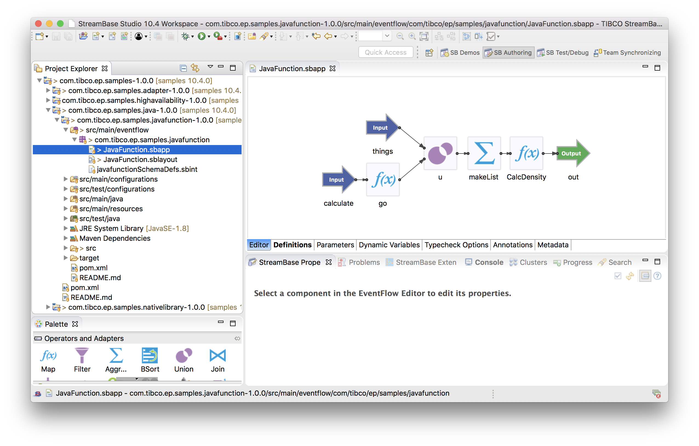
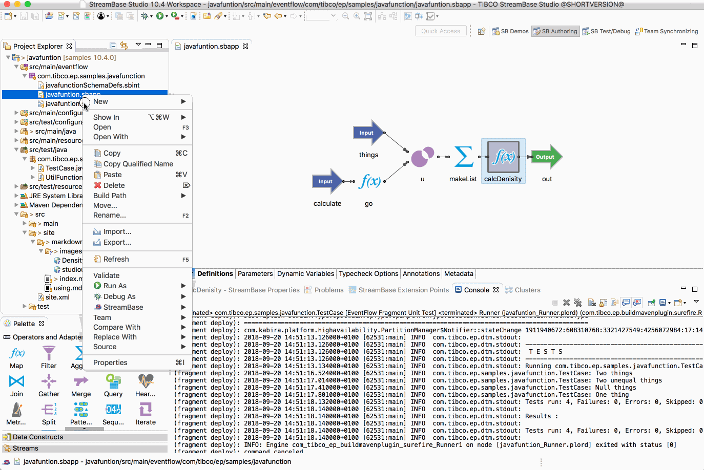
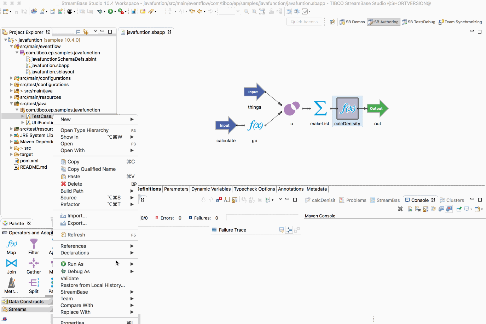
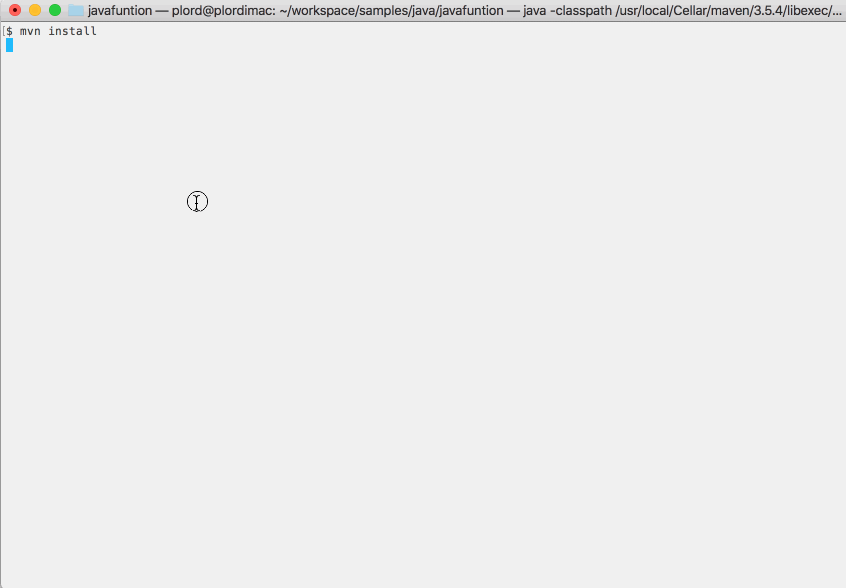

# Java : Java Function

This sample describes how to use java functions in EventFlow.

## EventFlow under test

In this sample the following simple EventFlow fragment is used :



## Declare the java function

This sample uses the following java function :

```java
/*******************************************************************************
 *
 * COPYRIGHT
 *      Copyright 2018 TIBCO Software Inc. ALL RIGHTS RESERVED.
 *      TIBCO Software Inc. Confidential Information
 *      
 *******************************************************************************/
package com.tibco.ep.samples.javafunction;

import java.text.MessageFormat;
import java.util.List;

import com.streambase.sb.CompleteDataType;
import com.streambase.sb.DataType;
import com.streambase.sb.Schema;
import com.streambase.sb.StreamBaseException;
import com.streambase.sb.Tuple;
import com.streambase.sb.TupleException;
import com.streambase.sb.client.CustomFunctionResolver;
import com.streambase.sb.operator.TypecheckException;

/**
 * Class for general-purpose utility functions that deal with Things
 */
public class UtilFunctions {

	/**
	 * Thing schema
	 */
    protected static Schema ThingSchema = new Schema(null,
            Schema.createField(DataType.STRING, "name"),
            Schema.createField(DataType.DOUBLE, "width"),
            Schema.createField(DataType.DOUBLE, "height"),
            Schema.createField(DataType.DOUBLE, "depth"),
            Schema.createField(DataType.DOUBLE, "weightKg"));

    private static Schema.Field WIDTH;
    private static Schema.Field HEIGHT;
    private static Schema.Field DEPTH;
    private static Schema.Field WEIGHTKG;

    static {
        try {
            WIDTH = ThingSchema.getField("width");
            HEIGHT = ThingSchema.getField("height");
            DEPTH = ThingSchema.getField("depth");
            WEIGHTKG = ThingSchema.getField("weightKg");
        } catch (TupleException e) {
            e.printStackTrace();
        }
    }

    /**
     * @param things tuples
     * @return the avg density of a bunch of Things
     */
    @CustomFunctionResolver("DensityCustomFunctionResolver0")
    public static Double Density(List<Tuple> things) {
        if(things == null || things.size() == 0)
            return null;

        double sumDensity = 0.0;
        int numValidThings = 0;
        Double density = null;

        try {
            for(Tuple t : things) {
                if(!(t.isNull(WIDTH) || t.isNull(HEIGHT) || t.isNull(DEPTH) || t.isNull(WEIGHTKG))) {
                    double volume = Math.abs(t.getDouble(WIDTH) * t.getDouble(HEIGHT) * t.getDouble(DEPTH));
                    if(!t.isNull(WEIGHTKG) && volume > 0.0) {
                        sumDensity += t.getDouble(WEIGHTKG) / volume;
                        ++numValidThings;
                    }
                }
            }

            if(numValidThings > 0)
                density = sumDensity / numValidThings;

        } catch (StreamBaseException e) {
            e.printStackTrace();
        }

        return density;
    }

    /**
     * <p>
     * A StreamBase Custom Function Resolver Function. This method is used by
     * StreamBase for type checking. Use this method to resolve functions that
     * take lists or tuples as arguments or return lists or tuples. This method
     * should be used to ensure the data types of your function are correct.
     * </p>
     * 
     * <p>
     * For custom functions that return simple types (the Java equivalents of
     * the simple StreamBase types: int, long, double, bool, string, blob,
     * timestamp), the returned CompleteDataType must be the appropriate
     * corresponding simple type (e.g., as returned by
     * CompleteDataType.forInt()). For custom functions that return non-simple
     * types (the Java equivalents of the non-simple StreamBase types: tuple,
     * list), the returned CompleteDataType must fully describe the appropriate
     * non-simple type (as returned by CompleteDataType.forTuple(Schema) or
     * CompleteDataType.forList(CompleteDataType))
     * </p>
     * 
     * @param things
     *            things
     * @return datatype
     * 
     * @see com.streambase.sb.client.CustomFunctionResolver
     */
    public static CompleteDataType DensityCustomFunctionResolver0(CompleteDataType things) {
        if(!things.equals(CompleteDataType.forList(CompleteDataType.forTuple(ThingSchema)))) {
            throw new Error(new TypecheckException(MessageFormat.format("Expected list of {0}, got {1}", ThingSchema, things)));
        }

        return CompleteDataType.forDouble();
    }

}
```

## Provide a engine configuration for EventFlow use

A engine configuration is required to declare the functions available :

```scala
name = "sbapp-calls-java-engine"
version = "1.0.0"
type = "com.tibco.ep.streambase.configuration.sbengine"
configuration =
{
    StreamBaseEngine =
    {
        streamBase =
        {
            pluginFunctions =
            {
                java =
                {
                    Density =
                    {
                        type = "simple"
                        alias = "density"
                        className = "com.tibco.ep.samples.javafunction.UtilFunctions"
                        autoArguments = true
                    }
                }
           }
        }
    }
}

```

## Running this sample from TIBCO StreamBase Studio&trade;

Use the **Run As -> EventFlow Fragment** menu option to run in TIBCO StreamBase Studio&trade;, and then enqueue tuples :



## Building this sample from TIBCO StreamBase Studio&trade; and running the unit test cases

Use the **Run As -> EventFlow Fragment Unit Test** menu option to build from TIBCO StreamBase Studio&trade; :



## Building this sample from the command line and running the unit test cases

Use the [maven](https://maven.apache.org) as **mvn install** to build from the command line or Continuous Integration system :


