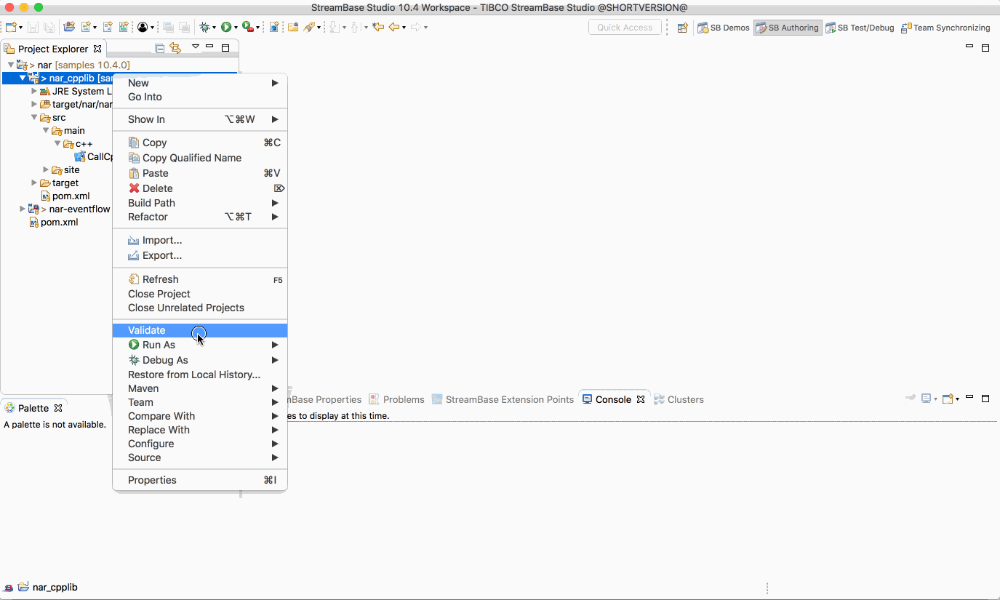
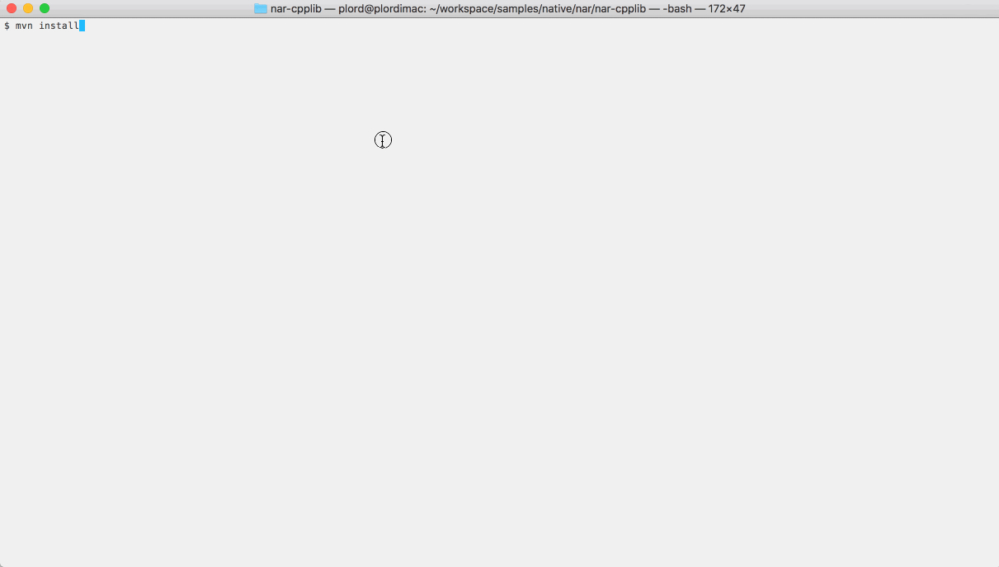

# Native : NAR

This sample describes how to build a maven Native ARchive files (.nar) from C++ source.  The
resulting archive can then be used in a downstream EventFlow fragment.

# C++ Source

The sample C++ source code provides functions to manipulate a static int :


```C++
#include "jni.h"
#include "com_tibco_ep_samples_nativelibrary_narcpplib_NarSystem.h"

extern "C" {

static int ivalue = 0;

JNIEXPORT jint JNICALL Java_com_tibco_ep_samples_nativelibrary_narcpplib_CallCpp_setCppInt(JNIEnv *env, jclass clazz, jint i)
{
  int oldval = ivalue;
  
  ivalue = i;
  
  return oldval;
}

JNIEXPORT jint JNICALL Java_com_tibco_ep_samples_nativelibrary_narcpplib_CallCpp_incrementCppInt(JNIEnv *env, jclass clazz, jint i)
{
  ivalue += i;
  return ivalue;
}


}
```

# Compilation to native library and generate NAR archive

The [maven nar plugin](http://maven-nar.github.io/) is used to invoke the native complier and build the Native ARchive file (.nar).  
The following maven build rule is used :

```xml
            <plugin>
                <groupId>com.github.maven-nar</groupId>
                <artifactId>nar-maven-plugin</artifactId>
                <extensions>true</extensions>
                <configuration>
                    <libraries>
                        <library>
                            <type>jni</type>
                            <narSystemPackage>com.tibco.ep.samples.nativelibrary.narcpplib</narSystemPackage>
                        </library>
                    </libraries>
                </configuration>
            </plugin>
```

# Running this sample from TIBCO StreamBase Studio&trade;

Use the **Run As -> Maven install** menu option to build from TIBCO StreamBase Studio&trade; :



# Running this sample from the command line

Use the [maven](https://maven.apache.org) as **mvn install** to build from the command line or Continuous Integration system :

