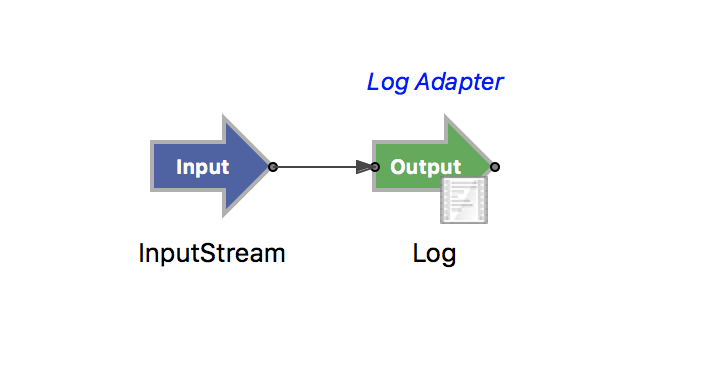

# helloworld

This sample shows the structure of an eventflow fragment.  Business logic and test cases
are about as simple as possible.

* EventFlow hello world application that simply writes input data to log adapter



* [Junit test case](../../test/java/com/tibco/ep/samples/helloworld/TestCase.java)

```java
    /**
     * test case
     * 
     * @throws StreamBaseException on error
     */
    @Test
    public void test1() throws StreamBaseException {
        LOGGER.info("Test Case 1");
        String inputTupleAsJSONString = "{'data':'Hello World'}";
        server.getEnqueuer("InputStream").enqueue(JSONSingleQuotesTupleMaker.MAKER, inputTupleAsJSONString);
    }
```

Expected results :

```
[INFO] --- ep-maven-plugin:1.4.0-SNAPSHOT:test-eventflow-fragment (default-test-eventflow-fragment) @ helloworld ---
[INFO] [dtm] INFO: Deploy tool version: [TIBCO Distributed Transactional Memory Platform 10.4.0-SNAPSHOT (build 1808220850)] starting at [Wed Aug 22 11:36:04 BST 2018]
[INFO] [dtm] INFO: Node version: [TIBCO StreamBase Runtime 10.4.0-SNAPSHOT (build 1808220859)]
[INFO] [dtm] INFO: Starting com.tibco.ep.buildmavenplugin.surefire.Runner on node A.helloworld ...
[INFO] [dtm] INFO: com.tibco.ep.buildmavenplugin.surefire.Runner started on JVM com_tibco_ep_buildmavenplugin_surefire_Runner0 on node A.helloworld.
[INFO] [A.helloworld] No user-defined Logback configuration, using product default configuration
[INFO] [A.helloworld] 2018-08-22 11:36:08.573000+0100 [81797:main] INFO  com.tibco.ep.dtm.stdout:
[INFO] [A.helloworld] -------------------------------------------------------
[INFO] [A.helloworld]  T E S T S
[INFO] [A.helloworld] -------------------------------------------------------
[INFO] [A.helloworld] Running com.tibco.ep.samples.helloworld.TestCase
[INFO] [A.helloworld] Test Case 1
[INFO] [A.helloworld] (tupleid=0,data="Hello World")
[INFO] [A.helloworld] Tests run: 1, Failures: 0, Errors: 0, Skipped: 0, Time elapsed: 2.981 sec
[INFO] [A.helloworld] 2018-08-22 11:36:11.561000+0100 [81797:main] INFO  com.tibco.ep.dtm.stdout:
[INFO] [A.helloworld] Results :
[INFO] [A.helloworld] 2018-08-22 11:36:11.561000+0100 [81797:main] INFO  com.tibco.ep.dtm.stdout:
[INFO] [A.helloworld] Tests run: 1, Failures: 0, Errors: 0, Skipped: 0
[INFO] [A.helloworld] 2018-08-22 11:36:11.561000+0100 [81797:main] INFO  com.tibco.ep.dtm.stdout:
[INFO] [dtm] INFO: Engine com_tibco_ep_buildmavenplugin_surefire_Runner0 on node [A.helloworld] exited with status [0]
[INFO] [helloworld] Finished "junit"
```

