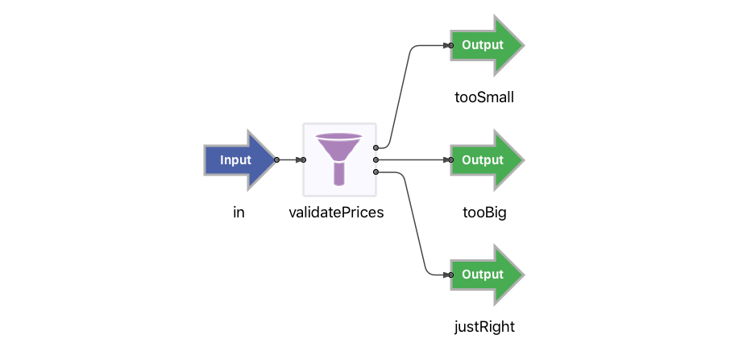

# Testing : Junit

This sample describes how to write junit unit tests for EventFlow fragments.

## EventFlow under test

In this sample the following simple EventFlow fragment is used :



## Using the test framework

Test cases can use the [test framework](http://devzone.tibco.com/sites/streambase/latest/sb/sb-product/documentation/reference/dtm/com/tibco/ep/testing/framework/package-frame.html) 
by inheriting from the [UnitTest](http://devzone.tibco.com/sites/streambase/latest/sb/sb-product/documentation/reference/dtm/com/tibco/ep/testing/framework/UnitTest.html) base class :

``` java
import com.tibco.ep.testing.framework.UnitTest;

public class TestCase extends UnitTest {
	...
}
```

This allows access to :

* [Running administration commands](http://devzone.tibco.com/sites/streambase/latest/sb/sb-product/documentation/reference/dtm/com/tibco/ep/testing/framework/Administration.html)
* [Loading HOCON configurations](http://devzone.tibco.com/sites/streambase/latest/sb/sb-product/documentation/reference/dtm/com/tibco/ep/testing/framework/Configuration.html)
* [Co-ordinating across multiple test node](http://devzone.tibco.com/sites/streambase/latest/sb/sb-product/documentation/reference/dtm/com/tibco/ep/testing/framework/MultiNodeCoordinator.html)
* [Deadlock detection](http://devzone.tibco.com/sites/streambase/latest/sb/sb-product/documentation/reference/dtm/com/tibco/ep/testing/framework/UnitTest.html#initialize--)
* [Managed object leak detection](http://devzone.tibco.com/sites/streambase/latest/sb/sb-product/documentation/reference/dtm/com/tibco/ep/testing/framework/UnitTest.html#initialize--)
* [Test case timeout handling](http://devzone.tibco.com/sites/streambase/latest/sb/sb-product/documentation/reference/dtm/com/tibco/ep/testing/framework/UnitTest.html#initialize--)
* [transactional abort mode](http://devzone.tibco.com/sites/streambase/latest/sb/sb-product/documentation/reference/dtm/com/tibco/ep/testing/framework/UnitTest.html#initialize--)


## Loading HOCON configuration

Any HOCON configurations required by the unit test case should be loaded and activated prior to starting the embedded server :

``` java
    @BeforeClass
    public static void setupServer() throws StreamBaseException, ConfigurationException, InterruptedException {
        // Example configuration load
        // Configuration.forFile("engine.conf").load().activate();
    	Configuration.forFile("engine.conf").load().activate();
    	
        // create a StreamBase server and load applications once for all tests in this class
        server = ServerManagerFactory.getEmbeddedServer();
        server.startServer();
        server.loadApp("com.tibco.ep.samples.junit.junit");
    }
```

## Test cases

Junit test cases can use the [unittest](http://devzone.tibco.com/sites/streambase/latest/sb/sb-product/documentation/reference/sb/com/streambase/sb/unittest/package-frame.html)
API to enqueue tubles and verify the results :

```java
    private void expectNothignElse() throws StreamBaseException {
        new Expecter(server.getDequeuer("tooSmall")).expectNothing();
        new Expecter(server.getDequeuer("tooBig")).expectNothing();
        new Expecter(server.getDequeuer("justRight")).expectNothing();
    }

    /**
     * Too small test case
     * @throws Exception Test failure
     */
    @Test
    public void tooSmall() throws Exception {
    	LOGGER.info("Too small");
        server.getEnqueuer("in").enqueue(JSONSingleQuotesTupleMaker.MAKER,
                "{'name':'a','price':-52.0,'quantity':100}");
        new Expecter(server.getDequeuer("tooSmall")).expect(
                JSONSingleQuotesTupleMaker.MAKER,
                "{'name':'a','price':-52.0,'quantity':100}");
        expectNothignElse();
    }
```

## Expected results

The exampled results from running this same is :

```
[INFO] [A.junit] -------------------------------------------------------
[INFO] [A.junit]  T E S T S
[INFO] [A.junit] -------------------------------------------------------
[INFO] [A.junit] Running com.tibco.ep.samples.junit.TestCase
[INFO] [A.junit] Too small
[INFO] [A.junit] TooSmall(tupleid=0,name="a",price=-52.0,quantity=100)
[INFO] [A.junit] Too big
[INFO] [A.junit] TooBig(tupleid=0,name="a",price=2500.0,quantity=200)
[INFO] [A.junit] TooSmall(tupleid=0,name="a",price=-52.0,quantity=100)
[INFO] [A.junit] TooBig(tupleid=0,name="a",price=2500.0,quantity=200)
[INFO] [A.junit] JustRight(tupleid=0,name="a",price=34.0,quantity=300)
[INFO] [A.junit] Just right
[INFO] [A.junit] JustRight(tupleid=0,name="a",price=34.0,quantity=300)
[INFO] [A.junit] Tests run: 4, Failures: 0, Errors: 0, Skipped: 0, Time elapsed: 5.76 sec
[INFO] [A.junit] 2018-09-17 10:27:21.615000+0100 [4092:main] INFO  com.tibco.ep.dtm.stdout:
[INFO] [A.junit] Results :
[INFO] [A.junit] 2018-09-17 10:27:21.616000+0100 [4092:main] INFO  com.tibco.ep.dtm.stdout:
[INFO] [A.junit] Tests run: 4, Failures: 0, Errors: 0, Skipped: 0
[INFO] [A.junit] 2018-09-17 10:27:21.616000+0100 [4092:main] INFO  com.tibco.ep.dtm.stdout:
```
