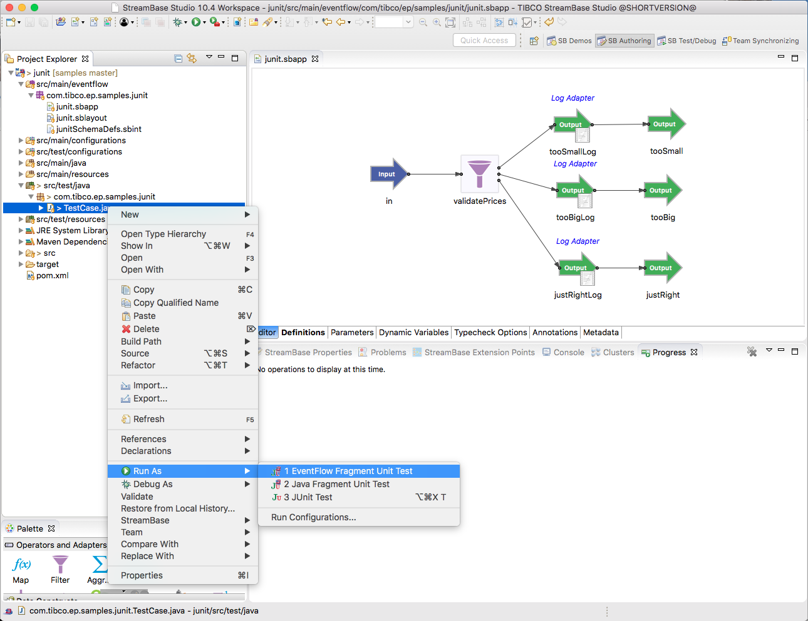

# Testing : Junit

This sample describes how to write junit unit tests for EventFlow fragments.

## EventFlow under test

In this sample the following simple EventFlow fragment is used :


## Using the test framework

Test cases can use the [test framework](http://devzone.tibco.com/sites/streambase/latest/sb/sb-product/documentation/reference/dtm/com/tibco/ep/testing/framework/package-frame.html) 
by inheriting from the [UnitTest](http://devzone.tibco.com/sites/streambase/latest/sb/sb-product/documentation/reference/dtm/com/tibco/ep/testing/framework/UnitTest.html) base class :

``` java
import com.tibco.ep.testing.framework.UnitTest;

public class TestCase extends UnitTest {
	...
}
```

This allows access to :

* [Running administration commands](http://devzone.tibco.com/sites/streambase/latest/sb/sb-product/documentation/reference/dtm/com/tibco/ep/testing/framework/Administration.html)
* [Loading HOCON configurations](http://devzone.tibco.com/sites/streambase/latest/sb/sb-product/documentation/reference/dtm/com/tibco/ep/testing/framework/Configuration.html)
* [Co-ordinating across multiple test node](http://devzone.tibco.com/sites/streambase/latest/sb/sb-product/documentation/reference/dtm/com/tibco/ep/testing/framework/MultiNodeCoordinator.html)
* [Deadlock detection](http://devzone.tibco.com/sites/streambase/latest/sb/sb-product/documentation/reference/dtm/com/tibco/ep/testing/framework/UnitTest.html#initialize--)
* [Managed object leak detection](http://devzone.tibco.com/sites/streambase/latest/sb/sb-product/documentation/reference/dtm/com/tibco/ep/testing/framework/UnitTest.html#initialize--)
* [Test case timeout handling](http://devzone.tibco.com/sites/streambase/latest/sb/sb-product/documentation/reference/dtm/com/tibco/ep/testing/framework/UnitTest.html#initialize--)
* [transactional abort mode](http://devzone.tibco.com/sites/streambase/latest/sb/sb-product/documentation/reference/dtm/com/tibco/ep/testing/framework/UnitTest.html#initialize--)


## Starting, stopping and loading HOCON configuration

Junit @beforeClass and @AfterClass functions can be used to start and stop the embedded server.  Likewise,
Junit @Before and @After functions can be used to start and stopo the containers.

Any HOCON configurations required by the unit test case should be loaded and activated prior to starting the embedded server :

``` java
    @BeforeClass
    public static void setupServer() throws StreamBaseException, ConfigurationException, InterruptedException {
        // Example configuration load
        // Configuration.forFile("engine.conf").load().activate();
    	Configuration.forFile("engine.conf").load().activate();
    	
        // create a StreamBase server and load applications once for all tests in this class
        server = ServerManagerFactory.getEmbeddedServer();
        server.startServer();
        server.loadApp("com.tibco.ep.samples.junit.junit");
    }

    /**
     * Stop the server
     *
     * @throws StreamBaseException on shutdown failure
     * @throws InterruptedException on shutdown failure
     */
    @AfterClass
    public static void stopServer() throws InterruptedException, StreamBaseException {
        try {
            if (server != null) {
                server.shutdownServer();
                server = null;
            }
        } finally {
            Configuration.deactiveAndRemoveAll();
        }
    }

    /**
     * Start the containers
     *
     * @throws StreamBaseException on start container error
     */
    @Before
    public void startContainers() throws StreamBaseException {
        // before each test, startup fresh container instances
        server.startContainers();

        // Setup test framework before running tests
        this.initialize();
    }
    
    /**
     * Stop containers
     *
     * @throws StreamBaseException on stop container error
     * @throws TransactionalMemoryLeakException Leak detected
     * @throws TransactionalDeadlockDetectedException Deadlock detected
     */
    @After
    public void stopContainers() throws StreamBaseException, TransactionalMemoryLeakException, TransactionalDeadlockDetectedException {
        // Complete test framework and check for any errors
        this.complete();

        // after each test, dispose of the container instances
        server.stopContainers();
    }
```

## Test cases

Junit test cases can use the [unittest](http://devzone.tibco.com/sites/streambase/latest/sb/sb-product/documentation/reference/sb/com/streambase/sb/unittest/package-frame.html)
API to enqueue tubles and verify the results :

```java
    /**
     * Too small test case
     * 
     * @throws StreamBaseException Test failure
     */
    @Test
    public void tooSmall() throws StreamBaseException {
    	LOGGER.info("Too small");
    	
        server.getEnqueuer("in").enqueue(JSONSingleQuotesTupleMaker.MAKER,
                "{'name':'a','price':-52.0,'quantity':100}");
        
        new Expecter(server.getDequeuer("tooSmall")).expect(
                JSONSingleQuotesTupleMaker.MAKER,
                "{'name':'a','price':-52.0,'quantity':100}");  
        new Expecter(server.getDequeuer("tooSmall")).expectNothing();
        new Expecter(server.getDequeuer("tooBig")).expectNothing();
        new Expecter(server.getDequeuer("justRight")).expectNothing();
    }
```

## Running this sample from Studio

To run unit test cases from Studio, use the Run As -> EventFlow Fragment Unit Test menu :



Results are displayed in the console and junit windows :


## Running this sample from the command line

To run unit test from the command line ( including from Continuous Integration systems ) use 
[maven](https://maven.apache.org) with the install goal :

```
$ mvn install
...
[INFO] --- ep-maven-plugin:1.4.0-SNAPSHOT:start-nodes (default-start-nodes) @ junit ---
[INFO] [A.junit] Running "install node"
[INFO] [A.junit] 	Installing node
[INFO] [A.junit] 		PRODUCTION executables
[INFO] [A.junit] 		File shared memory
[INFO] [A.junit] 		7 concurrent allocation segments
[INFO] [A.junit] 		Host name plordimac.plord.co.uk
[INFO] [A.junit] 		Container tibco/sb
[INFO] [A.junit] 		Starting container services
[INFO] [A.junit] 		Loading node configuration
[INFO] [A.junit] 		Auditing node security
[INFO] [A.junit] 		Administration port is 33419
[INFO] [A.junit] 		Discovery Service running on port 53568
[INFO] [A.junit] 		Service name is A.junit
[INFO] [A.junit] 	Node installed
[INFO] [A.junit] Finished "install node"
[INFO] [junit] Running "start node"
[INFO] [A.junit] 	Starting node
[INFO] [A.junit] 		Loading node configuration
[INFO] [A.junit] 		Auditing node security
[INFO] [A.junit] 		Host name plordimac.plord.co.uk
[INFO] [A.junit] 		Administration port is 33419
[INFO] [A.junit] 		Discovery Service running on port 53568
[INFO] [A.junit] 		Service name is A.junit
[INFO] [A.junit] 	Node started
[INFO] [junit] Finished "start node"
[INFO] 
[INFO] --- ep-maven-plugin:1.4.0-SNAPSHOT:test-eventflow-fragment (default-test-eventflow-fragment) @ junit ---
[INFO] [dtm] INFO: Deploy tool version: [TIBCO Distributed Transactional Memory Platform 10.4.0-SNAPSHOT (build 1809170954)] starting at [Mon Sep 17 14:52:43 BST 2018]
[INFO] [dtm] INFO: Node version: [TIBCO StreamBase Runtime 10.4.0-SNAPSHOT (build 1809161635)]
[INFO] [dtm] INFO: Starting com.tibco.ep.buildmavenplugin.surefire.Runner on node A.junit ...
[INFO] [dtm] INFO: com.tibco.ep.buildmavenplugin.surefire.Runner started on JVM com_tibco_ep_buildmavenplugin_surefire_Runner0 on node A.junit.
[INFO] [A.junit] No user-defined Logback configuration, using product default configuration
[INFO] [A.junit] 2018-09-17 14:52:47.380000+0100 [5457:main] INFO  com.tibco.ep.dtm.stdout:
[INFO] [A.junit] -------------------------------------------------------
[INFO] [A.junit]  T E S T S
[INFO] [A.junit] -------------------------------------------------------
[INFO] [A.junit] Running com.tibco.ep.samples.junit.TestCase
[INFO] [A.junit] Too small
[INFO] [A.junit] TooSmall(tupleid=0,name="a",price=-52.0,quantity=100)
[INFO] [A.junit] Too big
[INFO] [A.junit] TooBig(tupleid=0,name="a",price=2500.0,quantity=200)
[INFO] [A.junit] TooSmall(tupleid=0,name="a",price=-52.0,quantity=100)
[INFO] [A.junit] TooBig(tupleid=0,name="a",price=2500.0,quantity=200)
[INFO] [A.junit] JustRight(tupleid=0,name="a",price=34.0,quantity=300)
[INFO] [A.junit] Just right
[INFO] [A.junit] JustRight(tupleid=0,name="a",price=34.0,quantity=300)
[INFO] [A.junit] Tests run: 4, Failures: 0, Errors: 0, Skipped: 0, Time elapsed: 5.571 sec
[INFO] [A.junit] 2018-09-17 14:52:52.958000+0100 [5457:main] INFO  com.tibco.ep.dtm.stdout:
[INFO] [A.junit] Results :
[INFO] [A.junit] 2018-09-17 14:52:52.959000+0100 [5457:main] INFO  com.tibco.ep.dtm.stdout:
[INFO] [A.junit] Tests run: 4, Failures: 0, Errors: 0, Skipped: 0
[INFO] [A.junit] 2018-09-17 14:52:52.959000+0100 [5457:main] INFO  com.tibco.ep.dtm.stdout:
[INFO] [dtm] INFO: Engine com_tibco_ep_buildmavenplugin_surefire_Runner0 on node [A.junit] exited with status [0]
[INFO] [junit] Finished "junit"
[INFO] 
[INFO] --- ep-maven-plugin:1.4.0-SNAPSHOT:stop-nodes (default-stop-nodes-1) @ junit ---
[INFO] [A.junit] Running "stop node"
[INFO] [A.junit] 	Stopping node
[INFO] [A.junit] 		Engine application::com_tibco_ep_buildmavenplugin_surefire_Runner0 stopped
[INFO] [A.junit] 	Node stopped
[INFO] [A.junit] Finished "stop node"
[INFO] [A.junit] Running "remove node"
[INFO] [A.junit] 	Removing node
[INFO] [A.junit] 		Shutting down container services
[INFO] [A.junit] 		Removing node directory
[INFO] [A.junit] 	Node removed
[INFO] [A.junit] Finished "remove node"
...
```
